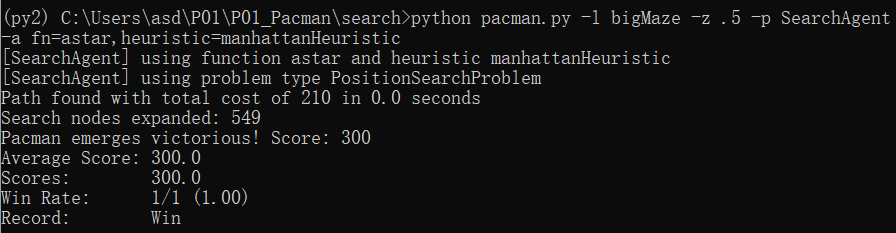
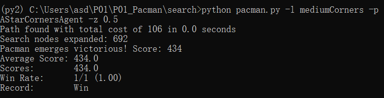
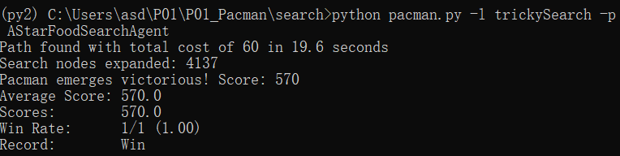

# P01 Pacman Game

| 学号     | 姓名   | 专业(方向)       |
| -------- | ------ | ---------------- |
| 19335016 | 陈浩然 | 计算机科学与技术 |

### 1.Idea of A* Algorithm (Use a few sentences to describe your understanding of the algorithm)

- $A^*$ 算法是一种在图形平面上，有多个节点的路径，求出最低通过成本的算法。该算法综合了最良优先搜索和 $Dijkstra$ 算法的优点：在进行启发式搜索提高算法效率的同时，可以保证找到一条最优路径（基于评估函数 $f(n)$ ）。$\displaystyle g(n)$ 表示从起点到任意顶点 $n$ 的实际距离，$h(n)$ 表示任意顶点 $n$ 到目标顶点的估算距离（根据所采用的评估函数的不同而变化）.$f(n)=g(n)+h(n)$

### 2. Idea of Min-Max and alpha-beta pruning algorithms

- $Min-Max$ 算法是一种找出失败的最大可能性中的最小值的算法。该算法是一个零总和算法，即一方要在可选的选项中选择将其优势最大化的选择，另一方则选择令对手优势最小化的方法。而开始的时候总和为0。
- $\alpha-\beta$ 算法是一种搜索算法，用以减少$Min-Max$ 算法搜索树的节点数。这是一种对抗性搜索算法，主要应用于机器游玩的二人游戏。当算法评估出某策略的后续走法比之前策略的还差时，就会停止计算该策略的后续发展。

### 3. Codes

**Question 1**

```python
	pq = util.PriorityQueue()
    flag, path = [], []

    start = {
        'state' : problem.getStartState(),
        'cost' : 0,
        'parent' : None,
        'action' : None,
        'h' : heuristic(problem.getStartState(), problem)
    }

    pq.push(start, start['cost'] + start['h'])

    while (not pq.isEmpty()):
        top = pq.pop()
        if (top['state'] not in flag):
            flag.append(top['state'])

            if (problem.isGoalState(top['state'])):
                break
            arr = problem.getSuccessors(top['state'])

            for succ in list(arr):
                if (succ[0] not in flag):
                    child = {
                        'state' : succ[0],
                        'cost' : top['cost'] + succ[2],
                        'parent' : top,
                        'action' : succ[1],
                        'h' : heuristic(succ[0], problem)
                    }
                    pq.update(child, child['cost'] + child['h'])

    v = top
    while (v['action'] != None):
        path = [v['action']] + path
        v = v['parent']
    
    return path
    util.raiseNotDefined()
```

**Question 2**

```python
def __init__(self, startingGameState):
    ...
    "*** YOUR CODE HERE ***"
    self.notVisitedCorners = []
    for _ in list(self.corners):
        if (self.startingPosition != _):
            self.notVisitedCorners.append(_)
    def getStartState(self):
        ...
        "*** YOUR CODE HERE ***"
        return (self.startingPosition, self.notVisitedCorners)
        util.raiseNotDefined()
    def isGoalState(self, state):
        ...
        "*** YOUR CODE HERE ***"
        if (len(state[1]) == 0):return True
        return False
        util.raiseNotDefined()
    def getSuccessors(self, state):
			...
            "*** YOUR CODE HERE ***"
            x, y = state[0]
            dx, dy = Actions.directionToVector(action)
            nextx, nexty = int(x + dx), int(y + dy)
            hitsWall = self.walls[nextx][nexty]
            cost = 1

            if (not hitsWall):
                arr = state[1][:]
                if ((nextx, nexty) in state[1]):
                    arr.remove((nextx, nexty))
                    successors.append((((nextx, nexty), arr), action, cost))
                else:
                    successors.append((((nextx, nexty), state[1]), action, cost))
        self._expanded += 1
        return successors
def cornersHeuristic(state, problem):
    ...
    "*** YOUR CODE HERE ***"
    arr = state[1][:]
    place = state[0]
    h = 0

    while arr != []:
        minn, i, j = 1919810, 0, 0
        for _ in arr:
            dis = abs(place[0] - _[0]) + abs(place[1] - _[1])
            if (dis < minn):
                minn = dis
                j = i
            i += 1          
        h += minn
        place = arr[j]
        arr.remove(place)
    return h 
```

**Question 3**

```python
def foodHeuristic(state, problem):
    ...
    "*** YOUR CODE HERE ***"
    foods = foodGrid.asList()
    res = 0
    if (len(foods) == 0):
        return 0 

    for food in foods: 
        newProblem = PositionSearchProblem(problem.startingGameState, 
                                           start = position, 
                                           goal = food, 
                                           warn=False, 
                                           visualize=False)
        distance = len(search.bfs(newProblem))
        res = max(res, distance) 
    return res
```

**Question 4**

```python
        def MinimaxSearch(self, gameState, curDepth, agentIndex):
        if agentIndex >= gameState.getNumAgents():
            return self.MinimaxSearch(gameState, curDepth + 1, 0)
        if gameState.isWin() or gameState.isLose() or curDepth > self.depth:
            return self.evaluationFunction(gameState)

        legalMoves = []
        for action in gameState.getLegalActions(agentIndex):
            if action != 'Stop':
                legalMoves.append(action)

        scores = []
        for move in legalMoves:
            scores.append(self.MinimaxSearch(gameState.generateSuccessor(agentIndex, move), curDepth, agentIndex + 1))

        if agentIndex == 0:
            bestScore = max(scores)
            if curDepth == 1:
                bestInd = []
                for i in range(len(scores)):
                    if scores[i] == bestScore:
                        bestInd.append(i)

                index = random.choice(bestInd)
                return legalMoves[index]

            return bestScore
        else:
            return min(scores)

    def getAction(self, gameState):
        """
        ...
        """
        "*** YOUR CODE HERE ***"
        return self.MinimaxSearch(gameState, 1, 0)
```

**Question 5**

```python
        def AlphaBetaSearch(self, gameState, currentDepth, agentIndex, alpha, beta):
        if agentIndex >= gameState.getNumAgents():
            return self.AlphaBetaSearch(gameState, currentDepth + 1, 0, alpha, beta)
        if currentDepth > self.depth or gameState.isWin() or gameState.isLose():
            return self.evaluationFunction(gameState)

        legalMoves = []
        for action in gameState.getLegalActions(agentIndex):
            if action != 'Stop':
                legalMoves.append(action)

        if agentIndex == 0:
            if currentDepth == 1:
                scores = []
                for move in legalMoves:
                    scores.append(self.AlphaBetaSearch(gameState.generateSuccessor(agentIndex, move), currentDepth, agentIndex + 1, alpha, beta))

                bestScore = max(scores)

                bestInd = []
                for index in range(len(scores)):
                    if scores[index] == bestScore:
                        bestInd.append(index)
                chosenIndex = random.choice(bestInd)

                return legalMoves[chosenIndex]

            bestScore = -1145141919810
            for action in legalMoves:
                cur = self.AlphaBetaSearch(gameState.generateSuccessor(agentIndex, action), currentDepth, agentIndex + 1, alpha, beta)
                bestScore = max(bestScore, cur)
                if bestScore >= beta:
                    return bestScore
                alpha = max(alpha, bestScore)
            return bestScore

        else:
            bestScore = 1145141919810
            for action in legalMoves:
                bestScore = min(bestScore,
                                self.AlphaBetaSearch(gameState.generateSuccessor(agentIndex, action), currentDepth,agentIndex + 1, alpha, beta))
                if alpha >= bestScore:
                    return bestScore
                beta = min(beta, bestScore)
            return bestScore

    def getAction(self, gameState):
        """
          Returns the minimax action using self.depth and self.evaluationFunction
        """
        "*** YOUR CODE HERE ***"
        a, b = -1145141919810, 1145141919810
        return self.AlphaBetaSearch(gameState, 1, 0, a, b)
```

### 4.结果展示



<center style="color:#C0C0C0;text-decoration:underline">Question 1</center>



<center style="color:#C0C0C0;text-decoration:underline">Question 2</center>



<center style="color:#C0C0C0;text-decoration:underline">Question 3</center>


<center style="color:#C0C0C0;text-decoration:underline">Question 4</center>


<center style="color:#C0C0C0;text-decoration:underline">Question 5</center>

以深度为3进行测试, 发现有输有赢.


### 5.结果分析

#### 1.Search in Pacman

- 在 $question1$ 中,其使用的 $h$ 函数为 $h(n)=0$, 通过使用优先队列初步实现 $A^{*}$ 算法;  在 $question2$ 中,通过 $Manhattan$ 距离实现 $h$ 函数; 而在 $question3$ 中, 使用了 $bfs$ 以实现.
- If u have innovation points, just write it down.

#### 2.Multi-Agent Pacman

- 假设最大树深为 $m$ , 每个非子节点最大后继节点数为 $b$,  $Min-Max$ 算法的时间复杂度为 $O(b^m)$, 空间复杂度为 $O(bm)$ , 而 $\alpha-\beta$ 剪枝算法时间复杂度一般为 $O(b^{m/2})$, 效率较前者提升一倍.                                                                                                        

### 6.Experimental experience
